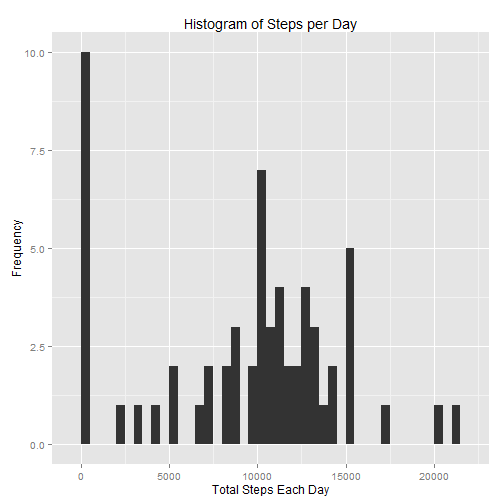
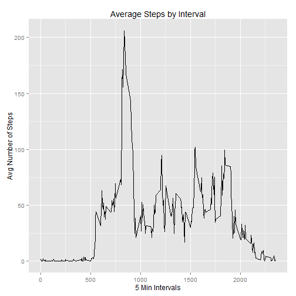
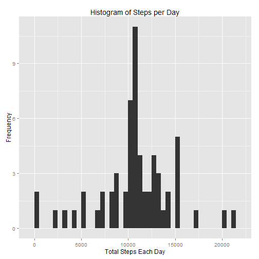
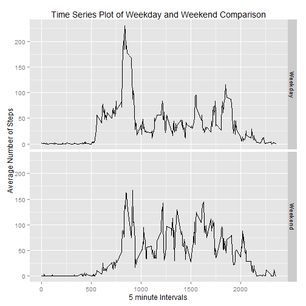

#Loading and preprocessing the data

##Assignment description
This assignment makes use of data from a personal activity monitoring device. This device collects data at 5 minute intervals through out the day. The data consists of two months of data from an anonymous individual collected during the months of October and November, 2012 and include the number of steps taken in 5 minute intervals each day.

* steps: Number of steps taking in a 5-minute interval (missing values are coded as NA)
* date: The date on which the measurement was taken in YYYY-MM-DD format
* interval: Identifier for the 5-minute interval in which measurement was taken


```r
#Load libraries
library(plyr)
library(ggplot2)
library(knitr)

#Load the data 
Data <- read.csv("activity.csv")
Data$date <- as.Date(Data$date)
```


#What is mean total number of steps taken per day?

Plot a histogram of the total number of steps taken each day

```r
##histogram of the total number of steps taken each day
Plot1 <- aggregate(x = Data$steps, by = list(Data$date), FUN = sum, na.rm = TRUE)
names(Plot1) <- c("date", "steps")
plot1.hist <- ggplot(Plot1, aes(x = steps)) +
        geom_histogram(binwidth = 500)+
        ggtitle("Histogram of Steps per Day") +
        xlab("Total Steps Each Day") +
        ylab("Frequency")
plot1.hist
```

 

Calculate the mean and median number of steps taken each day

```r
#mean total number of steps taken per day
mean(Plot1$steps , na.rm = TRUE)
```

```
## [1] 9354.23
```


```r
#median total number of steps taken per day
median(Plot1$steps, na.rm = TRUE)
```

```
## [1] 10395
```


#What is the average daily activity pattern?

Make a time series plot of the average number of steps taken

```r
#Avg number of steps by 5 minute intervals
Plot2  <- aggregate(x = Data$steps, by = list(Data$interval), FUN = mean, na.rm = TRUE)
names(Plot2) <- c("interval", "steps")
plot2.line <- ggplot(Plot2, aes(interval, steps)) +
        ggtitle("Average Steps by Interval") +
        xlab("5 Min Intervals") +
        ylab("Avg Number of Steps") +
        geom_line(linetype = 1)
plot2.line
```

 

The 5-minute interval that, on average, contains the maximum number of steps

```r
Plot2[which.max(Plot2$steps), c("interval")]
```

```
## [1] 835
```


#Imputing missing values

Find missing values:

```r
#Find number of rows of missing values
nrow(Data[is.na(Data$steps),])
```

```
## [1] 2304
```
There are 2304 missing values in the dataset.

Fill in missing values; I'll use the 5 minute interval mean.

```r
#Create a copy
Data2 <- Data
Data2$steps[is.na(Data2$steps)] <- tapply(Data2$steps, Data2$interval, mean, na.rm = TRUE)
```

Compare

```r
#Old
summary(Data)
```

```
##      steps             date               interval     
##  Min.   :  0.00   Min.   :2012-10-01   Min.   :   0.0  
##  1st Qu.:  0.00   1st Qu.:2012-10-16   1st Qu.: 588.8  
##  Median :  0.00   Median :2012-10-31   Median :1177.5  
##  Mean   : 37.38   Mean   :2012-10-31   Mean   :1177.5  
##  3rd Qu.: 12.00   3rd Qu.:2012-11-15   3rd Qu.:1766.2  
##  Max.   :806.00   Max.   :2012-11-30   Max.   :2355.0  
##  NA's   :2304
```

```r
#New
summary(Data2)
```

```
##      steps             date               interval     
##  Min.   :  0.00   Min.   :2012-10-01   Min.   :   0.0  
##  1st Qu.:  0.00   1st Qu.:2012-10-16   1st Qu.: 588.8  
##  Median :  0.00   Median :2012-10-31   Median :1177.5  
##  Mean   : 37.38   Mean   :2012-10-31   Mean   :1177.5  
##  3rd Qu.: 27.00   3rd Qu.:2012-11-15   3rd Qu.:1766.2  
##  Max.   :806.00   Max.   :2012-11-30   Max.   :2355.0
```

Plot a histogram of the new data set

```r
Plot3 <- aggregate(x = Data2$steps, by = list(Data2$date), FUN = sum, na.rm = TRUE)
names(Plot3) <- c("date", "steps")
plot3.hist <- ggplot(Plot3, aes(x = steps)) +
        geom_histogram(binwidth = 500)+
        ggtitle("Histogram of Steps per Day") +
        xlab("Total Steps Each Day") +
        ylab("Frequency")
plot3.hist
```

 

Calculate the mean and median of the new data set

```r
#mean total number of steps taken per day
mean(Plot3$steps , na.rm = TRUE)
```

```
## [1] 10766.19
```


```r
#median total number of steps taken per day
median(Plot3$steps, na.rm = TRUE)
```

```
## [1] 10766.19
```


#Are there differences in activity patterns between weekdays and weekends?

Create a new variable in the dataset with two values - "weekday" and "weekend"

```r
#Make a copy
Data3 <- Data2
#Add the weekday and weekend values
Data3$weekday <- as.factor(ifelse(weekdays(Data3$date) %in% c("Saturday", "Sunday"), "Weekend", "Weekday"))
Plot4  <- aggregate(x = Data3$steps , by = list(Data3$interval, Data3$weekday), FUN = mean, na.rm = TRUE)
names(Plot4) <- c("interval","weekday","steps")
plot4.line <- ggplot(Plot4, aes(interval, steps)) +
        ggtitle("Time Series Plot of Weekday and Weekend Comparison") +
        xlab("5 minute Intervals") +
        ylab("Average Number of Steps") +
        facet_grid(weekday ~ .) +
        geom_line(linetype = 1)
plot4.line  
```

 


